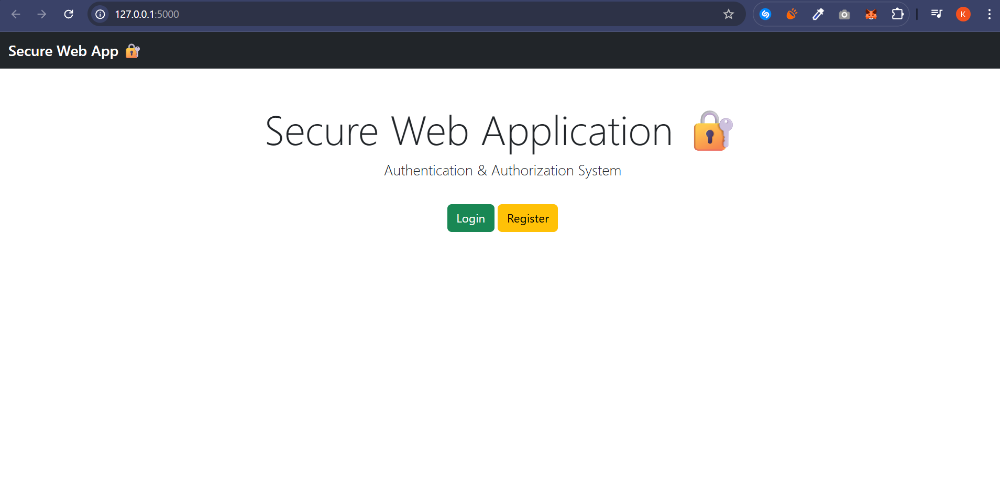

# 🔐 Secure Web Authentication & Authorization System

## 📌 Project Overview
This project is a secure web application built using Flask.
It demonstrates secure authentication and authorization mechanisms with layered security controls.

---

## 🚀 Technologies Used
- Python (Flask)
- Flask-Login
- Flask-Bcrypt
- Flask-Limiter
- SQLAlchemy
- SQLite
- Bootstrap 5

---

## 🔒 Security Features Implemented

### 1️⃣ Password Hashing
- Passwords are hashed using bcrypt.
- Prevents plain-text password storage.

### 2️⃣ CSRF Protection
- CSRF tokens added to all forms.
- Prevents cross-site request forgery attacks.

### 3️⃣ Account Lockout Mechanism
- Account locks after 5 failed login attempts.
- Unlocks after 15 minutes.

### 4️⃣ IP-Based Rate Limiting
- Login route limited to 5 requests per minute per IP.
- Prevents brute-force attacks.

### 5️⃣ Role-Based Access Control (RBAC)
- Admin route protected.
- Only users with role="admin" can access.

### 6️⃣ Secure Session Handling
- HTTPOnly cookies enabled.
- Secure session configuration.

### 7️⃣ Custom Error Pages
- 403 (Forbidden)
- 404 (Not Found)
- 405 (Method Not Allowed)
- 429 (Too Many Requests)

---

## 🔄 Application Flow

1. User registers (password validated & hashed)
2. User logs in
3. Failed attempts tracked
4. Account locks after threshold
5. IP rate limit enforced
6. Admin route protected with role check

---

## 📷 Screenshots

(Add screenshots of:)
- Home Page

- Login Page
- Dashboard
- Admin Panel
- Locked Account
- Rate Limit Page

---

## 📁 Project Structure

